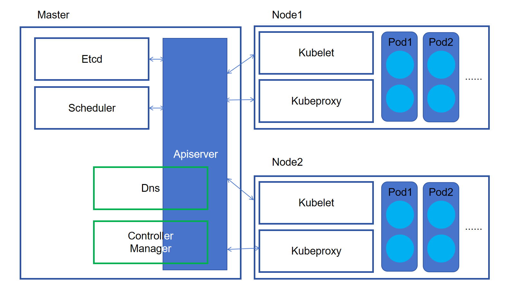
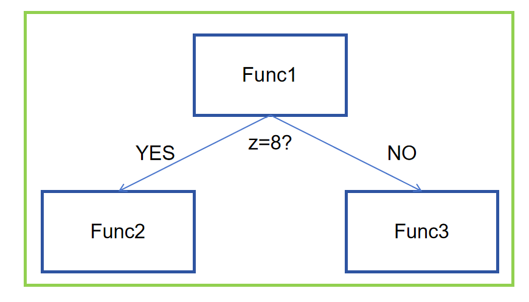
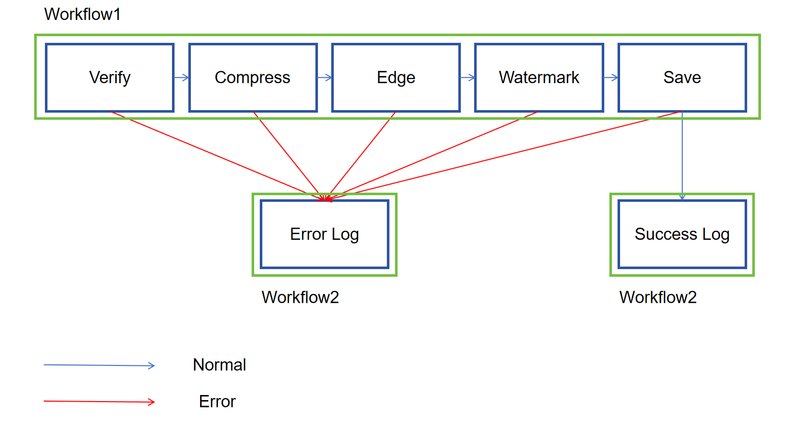

## Minik8s 说明文档

>本文档将对《SE3356 云操作系统设计与实践》课程项目Minik8s各方面进行说明。本组为第4小组。

<br/>

### 项目信息

**Github项目地址**：https://github.com/influ3nza/Minik8s

**项目各分支介绍**：
  - **main**：主分支。通过测试的分支，最终会合并在这里。
  - **develop**：开发分支。所有增加的功能在合并至main分支前，都会先合并至这个分支上。
  - **feature/apiserver**：在项目初期建立的有关apiserver的HTTP处理函数的分支。
  - **feature/scheduler**：在项目初期建立的有关scheduler的分支，负责调度pod。
  - **GJX/feature-kubelet**：有关kubelet的分支，负责pod的生命周期管理以及pod通信。
  - **feature/kubeproxy**：有关kubeproxy的分支，负责网络通信等功能。
  - **feature/kubectl**：有关kubectl的分支，负责用户与Minik8s组件之间的交互。
  - **feature/replicasetandhpa**：有关replicaset controller和hpa controller的分支，单独负责这一块功能的开发。
  - **feature/serverless**：有关serverless的分支，负责function，workflow等功能。
  - **feature/pv**：有关pv的分支，负责PV和PVC等功能。
  - **feature/gpu**：有关gpu的分支。
  - **feature/monitor**：有关pod监控的分支，负责node节点上的资源监控。
  - **ApiObject**：负责记录所有ApiObject以及const数据的分支，在有任何更新的时候会及时推送到所有其他分支。
  - 注：其余分支均已被弃用。

**CI/CD**：本项目使用CI/CD测试框架，将代码push至github上面之后可以根据test文件自动进行计划好的测试。CI/CD分为构建与测试两个部分，在模块分支开发时，以测试为主，当不同分支进行集成时，需要通过构建和代码测试。
```

```

**软件测试方法**：所有功能均在服务器上进行多机测试完毕之后方可提交。在项目中有test文件夹，其中有若干go的test文件。在命令行中输入```go test ...```即可对某一个功能点进行测试。

**项目开发流程**：在需要添加新功能的时候，从现有的分支中fork出一个新的分支进行编写。将每一个分支都需要用到的重要元数据（如apiObject）作为单独的分支存放，在需要进行修改的时候及时更新到所有分支上。在一个独立的功能编写完毕之后，将其合并到原来的分支上。

我们的小组以一天为颗粒度进行项目的开发和功能的推进。在项目初期先对项目进行了解构，拆分出了若干较为独立的功能，便于分工。在开发的过程中，组员之间积极交流，主要在软件大楼4楼某一个固定的区域进行开发。我们会及时根据进度调整组员的分工，如果某一个组员临时有事，则会动态分配他的工作量。

一套完整的开发流程如下：
确定功能->查阅相关文档和源代码->开始书写代码->个人的单元测试->小组成员间的集成测试->合并到主分支->进行下一个功能的开发

<br/>

### 项目架构

本项目（以下简称Minik8s）以Golang为主要语言。参考了Kubernetes（以下简称k8s）的实现架构，并在此基础上考虑到实现的便利，进行了一定程度的修改。Minik8s主要由控制平面（Master）和工作节点（Worker）两部分组成，以下为具体的内容：

**Master**：
  - Apiserver：负责处理各种HTTP请求，是整个Minik8s的中心。同时也会发送HTTP请求和消息去联系起其他组件。可以与可持续化存储ETCD进行交互。
  - Scheduler：负责pod的调度。在Apiserver发送创建Pod的请求时，会根据一定的策略为这个Pod选择合适的Node。
  - Controller：包括Endpoint Controller，Replicaset Controller和HPA Controller。由一个Controller Manager统一管理，具体的细节见后文。
  - DNS：***TODO***
  - Serverless：自选项目。在Master节点上的一个独立组件，与Apiserver进行交互之后，负责创建Function的镜像与指挥执行Function和Workflow。

**Worker**：
  - Kubelet：管理Pod的生命周期，在Pod意外终止时，会主动将其重启。
  - Kubeproxy：***TODO***

**其他组件**：
  - Kafka消息队列：是Minik8s中除了HTTP请求之外的另外一种组件之间通信的方式，保证了异步请求的执行。
  - ***TODO***

<center>Minik8s架构示意图</center>

<br/>

### 使用的软件栈
Minik8s使用的主要软件栈如下：
  - Kafka消息队列：github.com/IBM/sarama
  - Go HTTP框架：github.com/gin-gonic/gin
  - 可持续存储Etcd：go.etcd.io/etcd/client/v3
  - 命令行工具：github.com/spf13/cobra
  - ***TODO：待补充***

Minik8s使用的主要开源组件如下：
  - YAML解析：gopkg.in/yaml.v3
  - JSON解析：github.com/tidwall/gjson
  - 命令行表格美化：github.com/olekukonko/tablewriter
  - 容器运行时：github.com/containerd/containerd 等
  - 文件监控：github.com/fsnotify/fsnotify
  - UUID生成：github.com/google/uuid
  - 定义模板： text/template
  - ipvs服务： github.com/moby/ipvs
  - ***TODO：待补充***

### 小组成员
**成员信息**：
|姓名|学号|贡献度|
|----|----|----|
|竺天灏|521021910101|37.5%|
|高健翔|521021910197|37.5%|
|陈超|521021910136|25%|

**具体分工**：
竺天灏：apiserver主要功能，scheduler，endpoint controller，kubectl主要功能，消息队列，workflow，replicaset controller和HPA controller完善，PV个人作业，演示视频剪辑，结题文档编写。
高健翔：***TODO***
陈超：***TODO***

### 组件详解

> 此部分更为详细地介绍了Minik8s中主要组件的功能。
注：仅包括主要组件，部分组件可能不在其中。

#### Apiserver
**Apiserver**
可以说是Minik8s的核心组件。因为是除了DNS以外唯一和Etcd直接交互的组件，所以所有的读写请求必须要经过Apiserver。不仅如此，Apiserver还负责了联系起其他组件的作用。

Apiserver注册的HTTP请求方法：
**ip:port/*涉及的Api对象*/*请求方法*/*路径变量（可选）***

**Etcd**
是Minik8s的存储组件，由Apiserver统一进行增删改查。

Etcd的数据存储路径：
**/registry/*Api对象*/*Namespace*/*Name***
注：有一些重要元数据的存储路径为其他样式。

#### Scheduler
用于Pod创建时的调度。在Pod创建时，Scheduler会通过Round Rabin、Random或是LeastMem三种策略调度Pod，为其分配对应的node。Pod从无到有的生命周期将会在Pod抽象一节中详细介绍。

#### Controller
Controller作为了Apiserver中的一个成员，方便管理。

**Controller Manager**
负责管理所有Controller的启动和关闭，因此Apiserver在启动时只需要创建一个Controller Manager实例即可。

**Endpoint Controller（EPC）**
Endpoint是将Service和Pod建立起沟通的桥梁，具体的实现架构在Service抽象一节中会提到。EPC会监听Service的创建和删除、以及Pod的创建和删除（以上四个事件均以消息的形式发送至EPC的信箱），并依此增删相对应的Endpoint。确定好增删Endpoint的列表之后，会向Apiserver发送创建Endpoint的请求。

**Replicaset Controller**

**HPA Controller**

#### DNS
dns组件负责dns与转发的实现，在dns被创建时，pod与node可以通过访问域名+不同的path，其流量被转发到不同的service clusterIP。

#### Kubectl
使用Cobra命令行工具，并基本参考了Kubernetes的命令。

支持如下的命令：
  - ```kubectl apply -f <文件名>.yaml``` 创建一个Api对象，种类由文件中的```Kind```域指定。
  - ```kubectl delete <Api对象类型> <namespace>/<name>``` 删除一个Api对象，如果该对象不存在或者使用了错误的Api对象类型，则会相应报错。有一些Api对象类型只需要```name```作为参数，如dns等.
  - ```kubectl get <Api对象类型>``` 获取该类型所有Api对象的状态。有一些Api对象类型支持通过```namespace/name```进行查找，如Pod等。
  - ```kubectl update <文件名>.yaml``` **仅用于Serverless。** 通过文件来对函数的内容进行更新。
  - ```kubectl exec workflow/function <name> [-f] <params in json/filename>``` **仅用于Serverless。** 执行一个已经存在的函数或者函数链，可以通过```-f```指定是否将文件中的内容作为参数传入。

#### Kubelet
部署在各个node上的组件，负责接收Apiserver对于pod的操作请求，管理pod的生命周期，定期向Apiserver同步pod的相关信息，同时作为心跳，表示node仍在运行；为Apiserver提供pod的监控指标；对于function类型的pod，则以容器为单位进行管理，但是对外部仍然提供pod的抽象。

实现：
1. 镜像管理 image_manager
   1. 通过containerd client提供的接口从docker镜像仓库进行拉取
   2. 在完成serverless的过程中，需要搭建master节点的镜像仓库，对于这些镜像进行特殊处理，使用nerdctl工具完成镜像拉取
2. 

#### Kubeproxy
部署在各个node上，接收Apiserver对于service的操作请求，使得集群内pod与node可以通过cluster ip以负载均衡的方式与pod进行通信，在minik8s外部，可以通过访问校园网ip+port来进行访问(node也可以通过node+port访问)


#### Serverless
是独立于Apiserver的一个组件。由Function Controller，Workflow Controller和AutoScale Controller组成。具体对于函数和函数链的实现细节见后文Serverless一节。


#### Kafka消息队列
在实现需要异步完成的通信时，考虑使用消息队列完成。在Kafka的应用中，消息的传递分为两个角色：Producer和Consumer，传递的消息通过Topic辨明自己的身份。

Minik8s使用IBM的Sarama库，并将其进行了一层封装。并非所有组件都注册有Producer和Consumer，但是一旦注册，其Consumer一定只能接收仅属于自己组件的Topic的消息。例如，Endpoint Controller注册有仅接收Topic为“EndpointController”的消息的Consumer。这样做可以保证组件之间的通信互不干扰，且保证了一个组件不会监听多个Topic导致消息被错误地消费。

为了保证功能的实现，消息不仅有自己的Topic，还通过Type辨明自己的来意。Consumer接收消息后，通过已经提前注册好的回调函数中的switch-case对消息进行相应的处理。

### 功能实现

> 此部分介绍了Minik8s在验收文档的要求下完成的功能及详细解释。

#### Pod抽象
**Pod是怎么诞生的：从无到有**
在用户通过kubectl创建一个Pod之后，kubectl会将请求以及Pod的信息传递给Apiserver。Apiserver会首先检查请求的Pod格式是否合法、是否已经存在，随后将Pod存入Etcd中，标记Pod的状态为Pending，即不可用，并向Scheduler发送创建Pod的消息。

Scheduler接收到消息之后，进行调度，将分配的Node计入Pod的```nodename```字段中，并向Apiserver发送更新Pod请求，即表明该Pod已经完成调度，准备真正创建。Apiserver在Etcd中更新完这一信息之后于是向对应Node上的Kubelet发送创建Pod的HTTP请求。

Kubelet接收到HTTP请求之后，会根据配置创建Pod，为Pod分配一个IP地址。创建完毕之后，会将新的IP地址以消息的形式发回给Apiserver，后者再次更新Etcd中的Pod结构体，并将这个Pod标记为Running，即可用。

随后Apiserver会向Endpoint Controller发送消息，表明一个Pod被创建，后者将会执行相应的Endpoint创建任务。

**监视Pod的状态**
在Minik8s的实现中，如果Pod意外终止（如被kill掉），那么将由Kubelet负责Pod的原地重启。不过重启之后Pod的IP地址将会改变，此时会向Apiserver发送Pod更新的消息，Apiserver接收到之后会修改Etcd，并通知Endpoint Controller进行Endpoint的修改。

各个Node上的Kubelet会定时向Apiserver获取该Node上所有Pod的信息，并一一与本地的Pod进行比对（Apiserver不会发送除了Success或Running以外状态的Pod）。如果发现有状态不一致，即本地Pod状态为Failed，则会开始原地重启的工作，并将该Pod的状态标记为Restarting，发送给Apiserver。

一个标准的单容器Pod的yaml文件如下：
```yaml
apiVersion: v1
kind: pod
metaData:
  labels:
    app: test
  name: pod-1
  nameSpace: q
spec:
  containers:
    - image: 
        imgName: docker.io/library/ubuntu:latest
        imgPullPolicy: Always
      name: testContainer-1
      entryPoint:
        workingDir: /
      ports:
        - containerPort: 80
          hostIP: 0.0.0.0
          hostPort: 0
          name: no name
          protocol: TCP
      env: 
        - name: www
          value: sdg
      volumeMounts:
        - mountPath: /home
          subPath: config
          name: testMount
          readOnly: false
      resources: 
        limits:
          cpu: 0.5
          memory: 100MiB
  volumes:
    - name: testMount
      type: ttype
      path: /test000
```

#### CNI功能（Pod间通信）

#### Service抽象
Service充当了Pod的门面。在用户通过Kubectl创建一个Service之后，Apiserver会首先将其存入Etcd，并通知Endpoint Controller。后者通过```selector```字段筛选对应的Pod，创建对应的Endpoint，并以列表的形式发送给Kubeproxy。Endpoint不支持通过命令行创建，一个Endpoint结构体的基本形式如下(省略了部分Metadata)：
```go
type Endpoint struct {
	SrvUUID string 
	SrvIP   string
	SrvPort int32  

	PodUUID string 
	PodIP   string 
	PodPort int32  
	Weight  int
}
```

Kubeproxy接收到Endpoint的创建请求之后，会依次创建相应的规则。

***TODO:如何创建规则***

#### Replicaset抽象

#### 动态伸缩（HPA）

#### DNS

#### 容错
依赖于Etcd这个可持续化存储，我们可以很好地应对Master节点或是Node节点突然重新启动的情况。在一个pod或是service被加入之后，会将相应的结构体存入Etcd之中。由于Pod的运行不依赖Kubelet，Kubelet只是充当了管理Pod的角色，所以Apiserver的重新启动不会影响到Pod的运行。同时，由于所有的规则存储于Kubeproxy中，所以Node节点的重启也不会影响到Service的再次访问。

#### 多机Minik8s
**Node的加入**
用户可以通过```kubectl apply node <文件名>.yaml```添加工作节点。在Apiserver重启后，无需重新添加节点，但是在Node节点本身重启后，需要显式重新添加节点。

**Scheduler的调度策略**
  - Round Rabin，即为Pod轮流分配节点。
  - Random，即随机挑选节点进行分配。
  - LeastMem，即Scheduler会向各个node发送请求查看Metrics，收到结果后比对各个node的硬盘用量，选取空余更多的一个node。

#### Serverless
**Function**
Function是Serverless执行的最小单位。用户可以通过```kubectl apply```添加函数，yaml文件示例如下：
```yaml
apiVersion: v1
kind: function
metaData:
  labels:
    app: test
  name: verify
filePath: /ZTH/Minik8s/test/serverless_func/verify
```
其中的```filePath```字段，表明用户希望上传的Function相关文件（包括python文件、Dockerfile、requirement.txt、server.py，其中除了第一项其他均为非必要，可以通过```useTemplate```字段进行设置）。这些文件均需存在于用户本地，由Kubectl打包为压缩文件上传到Apiserver，后者将其解压并存放到主机的指定位置。在这之后对Function的所有操作，除了update，全部按照主机上保存的文件为准。

在Minik8s中，Function会在Pod中运行。一个Pod中有一个Function独有的容器，需要执行函数时直接访问Pod的指定端口即可。Pod内运行的容器，其镜像是被专门组装过的。***TODO。*** Minik8s还提供了现成的组件保证function实例的增减，即replicaset。在一个函数被创建时，会自动创建一个独属于该函数的replicaset，由AutoScale Controller管理其replica的数量。

**Workflow**
Workflow，即函数链，是将多个函数串在一起构成的执行流。前一个函数的输出作为下一个函数的输入执行。在Minik8s中，将函数链抽象成DAG的形式，每一个函数、分支、调用操作都抽象为一个节点。最基本的节点是函数节点，即func节点，在yaml文件中的定义如下：
```yaml
- name: firstNode
      type: func
      funcSpec: 
        namespace: default
        name: func-1
        next: forkNode
```
```next```字段表明了该节点在执行完之后的执行流前进方向，即下一个应该执行哪一个节点。如果一个node不存在```next```字段，则表明该函数链的执行流在此终止。

用户可以通过调用```kubectl exec workflow <name> <param in json>```执行一个函数链。函数链的入口由yaml文件中的```startNode```字段指定。

在视频演示中展示了两个Workflow，一个较为简单，另一个较为复杂。两个函数链的结构图和详细说明见下：

<center><b>简单函数链：分支</b></center>

<br/>

这个函数链展示了我们是如何实现函数链中的分支的。Minik8s使用一种特殊的节点，称为fork节点，来实现条件判断以及改变执行流的前进方向。在yaml文件中的定义如下：
```yaml
- name: forkNode
      type: fork
      forkSpecs:
        - variable: z
          compareBy: NumE
          compareTo: "8"
          next: leftNode
        - ... # 可以书写更多分支
        - variable:
          compareBy: default
          compareTo:
          next: rightNode
```
```variable```字段表明比较哪一个变量；```compareBy```表明使用哪一种比较方式，支持等号与不等号；```compareTo```则表明具体要去比较的值。整个节点的结构抽象为代码语言可以表示为```if ... else if ... else if ... else ...```的形式。在这个简单函数链中，判断变量z是否等于8，根据结果来判断接下来执行哪一个分支。

<br/>


<center><b>复杂函数链：图片处理</b></center>

<br/>

这是一个更复杂的函数链，其输入除了必要的参数还有一张图片的base64编码。该函数链的作用是将一张图片经过审核、压缩、边缘化、加水印，最终存储于mysql当中。如果其中的任何一步出错，则调用另一条函数链中的log，表明执行失败。如果save成功，则调用这条函数链中的log，表明执行成功。

在这一条函数链中，调用了另外一条函数链，这用到了Minik8s的第三种node，即call节点。在yaml文件中的定义如下：
```yaml
- name: log
  type: call
  callSpec:
    wfName: wf-log
    inheritCoeff:
      - "username"
      - "status"
      - "error"
    newCoeff: "{\"add\":3,\"minus\":5}"
```
其中```inheritCoeff```表明需要从本函数链提交到新函数链作为参数的列表，```newCoeff```表明需要新添加的参数列表。Minik8s在执行时会将这两组参数融合为一组，暂不支持参数名的查重。

**自动扩容与scale-to-0**
为了应对高并发，Minik8s的serverless组件支持动态扩容。同时为了保证资源不被浪费，支持缩容到0的机制，具体实现如下：

在serverless组件中，为每一个已注册的函数保存一个数字，以下称之为**水位**。函数被第一次调用时，水位为某一指定的正整数。自第一次调用起，该水位就会随着时间不断减少。当水位减少到0的时候，serverless组件中的AutoScale Controller便会将该Function的Pod实例减少一个。与此同时，每当这个函数被调用一次时，水位便会增长一个指定的数值，该数值与该函数现存实例个数成反比。当水位超过一定的数值，AutoScale Controller便会为该函数增加一个Pod实例。这个水位的阈值与现存实例个数成正比。也就是说，一个Function的实例数线性增长，意味着在短时间内的大量请求需要以平方级别的速度增长。

**Event Trigger**
Minik8s支持通过注册事件驱动（在这里是监听文件修改）来触发函数。在Function的yaml文件中有一个```needWatch```字段，用来表明是否需要加入文件监听。若如此做，则serverless会监视位于主机上存放该Function的python文件以及Dockerfile等文件的文件夹。在文件夹中，有任何文件被写入，则额外触发一次函数。注意由于通过vim修改文件会产生较多的swap文件写入，所以文件监视默认屏蔽swap文件。

另一个问题是即使更新Function的```func.py```文件，额外触发的函数调用依然会使用原镜像，该功能基本已被```kubectl update```完全替代，因此不再做额外实现，请注意。

**并发性能**
serverless组件支持函数调用请求的数十并发。得益于消息队列本身的多进单出的队列特性，以及上文提到的水位设计，在其余的部分并没有做出太大的调整。

#### 持久化存储
使用PV和PVC这两个Api对象来进行持久化存储，PV代表系统分配的可持久化卷，PVC则是对持久化卷使用的声明。Minik8s支持静态创建PV，即通过```kubectl apply```创建一个PV；以及动态创建PV，即在创建PVC时，如果发现没有匹配的PV，则会主动创建一个符合条件的。

创建PVC时通过```selector```字段筛选符合条件的PV，其中可以包括capacity、kind等label。

使用NFS作为储存的方式，将NFS部署在Master节点上，创建PV时会分配一个文件夹，用于该持久卷存储的位置。修改本地的```/etc/exports```文件，随后会向各个节点的kubelet发送消息，令其远程将该文件夹挂载到本地的挂载点。在pod启动后，又会将本地的挂载点挂载到自己的工作目录。也就是说在pod启动后，pod的工作目录本质上就是master节点上的PV目录。

持久化卷的实现极大程度依赖于Kubelet对于Pod生命周期的管理，在Pod被删除或者意外终止时，会自动断开挂载但是保留本地文件，这也使得后续新建在这个PV上的Pod仍然能够访问原来的文件，保证了持久化存储。

#### 支持GPU应用

#### 日志与监控

### 其他，补充和备注